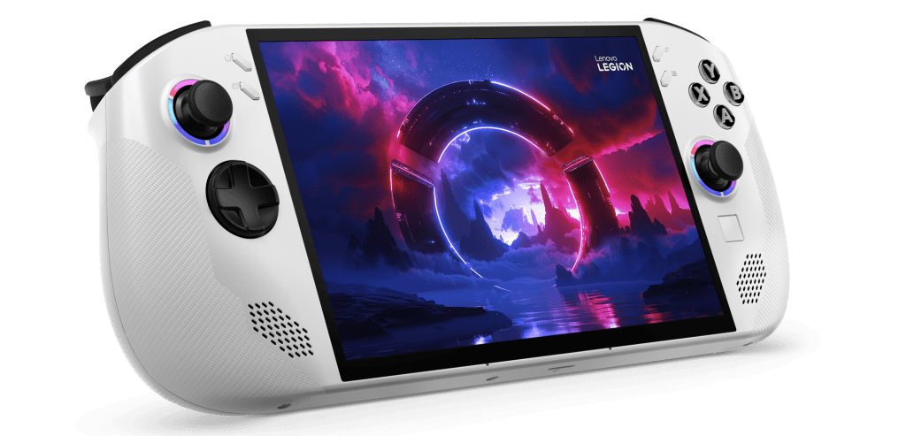

# WinDeck Legion Go Handheld

Windeck for Legion Go S is a new OS designed by a gamer for gamers made for gaming on the go.

This version of windsows enchances the power of the Legion Go S's hardware by improving the windows experience a bit better then the stock experience and utlizes Tiny 11 24H2 official conversion as a base for this project

## Features:
- Bloatware is very very minimal and do not automatically install.
- No more OneDrive
- High Priority APU when playing games and even productivity tasks
- Pre-set page file up to 32GB for VRAM purposes
- Microsoft Edge is not installed (bring your own browser)
- VRR Enabled by default
- Legion Go S 8ARP1 drivers come pre-installed.
- No automatic bitlocker encryption (can enable manually if you want).
- Microsoft account no longer required to setup windows, you will be able to create a local account and you can add a microsoft account anytime after setup if you like.
- No more hidden folders and no hidden file extensions to keep you safe and know what your about to launch and gain access to hidden folders without the need of manually unhiding them & more.

## Compatible devices:
The following devices is what we currently support, if you wish to have your device supported wither if it's the original legion go or different model of the Legion Go S please make an issue report, be sure to want this as it will need testers before it can be released to the public

- Legion Go S 8ARP1
